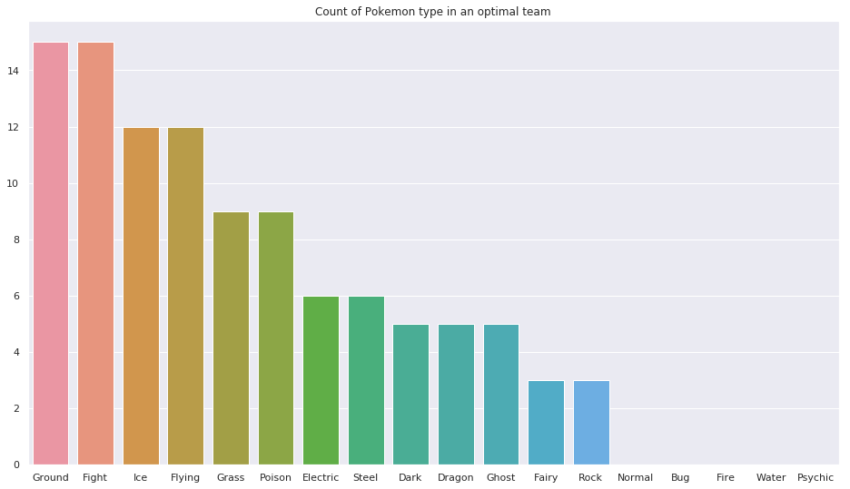

# Pokemon Optimal Team

I wanted to look for an 'optimal team' in Pokemon Sword/Shield. By optimal I mean a team such that for every opposing type there is a type in the team which is 'effective' against it (i.e. having a damage multiplier of 2). The surprising result for me (unless there are bugs, which might very well exist) is that we need at least 7 types in your team to achieve the goal. So you need at least one Pokemon with two types. 

## Optimal teams

These are the type counts in the optimal teams

## Getting started

Some ideas what you could do with this code:

1. Clone the repository
2. Have a look at the ipython notebooks (in particular 'Visualize 7 types results.ipynb')
3. Have a look at optimal_teams.py, if you want to figure out how I came up with the teams.
4. Write your own attribute table (to get optimal teams for other Pokemon versions). You can use 'attribute_table_sword_shield.csv' as a template (I created the table manually, but of course I did not come up with it).
5. Find some bugs :-)
